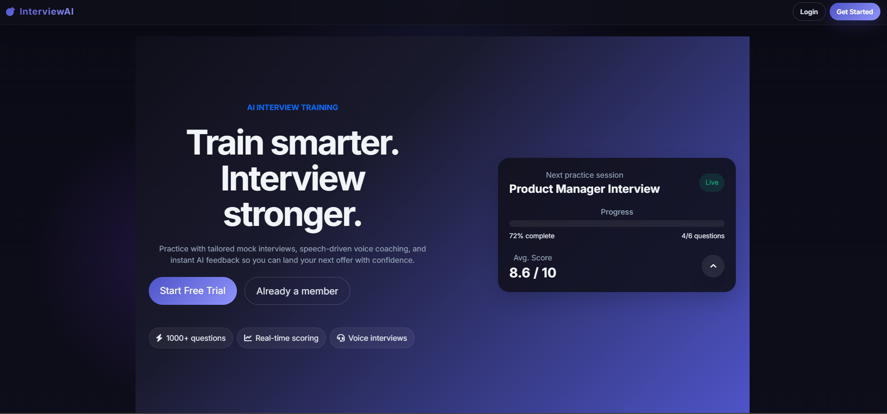
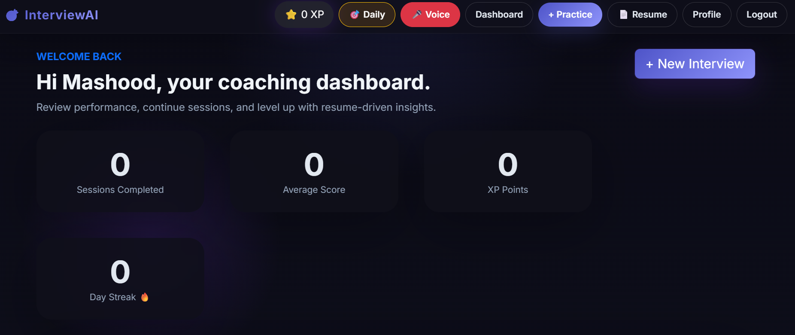
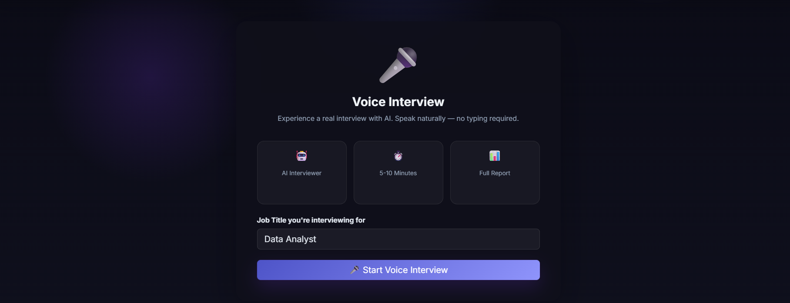
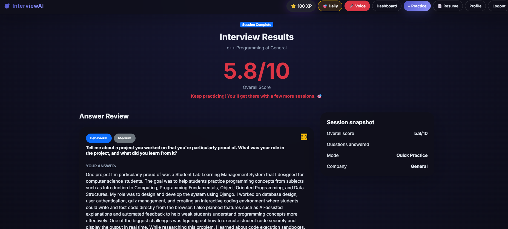

# 🎯 AI Interview Trainer

> An AI-powered mock interview platform that helps you ace your next job interview with voice interviews, resume analysis, and real-time feedback.


---

## 🌐 Live Demo

👉 **[mashhoodoyy.pythonanywhere.com](https://mashhoodoyy.pythonanywhere.com)**

---

## 📸 Screenshots

### Homepage


### Dashboard


### Voice Interview


### Results Page


---

## ✨ Features

- 🤖 **AI Generated Questions** — LLaMA AI generates personalized interview questions based on your job title and target company
- 🎤 **Voice Interview** — AI speaks questions out loud, listens to your answers, scores them in real time — just like a real interview
- 📄 **Resume Analysis** — Upload your resume and get AI feedback on strengths, weaknesses, missing skills and ATS score
- 📊 **Progress Dashboard** — Track your improvement over time with charts and session history
- 🏆 **Badges and XP** — Earn XP points and badges for completing sessions, streaks and perfect scores
- 🔥 **Streak System** — Practice daily to build and maintain your streak
- 🎯 **Daily Challenge** — One question every day for consistent practice
- 👤 **User Profiles** — Set your target role, experience level and upload your resume
- 🔐 **Authentication** — Secure signup, login and logout

---

## 🛠️ Tech Stack

| Technology | Purpose |
|------------|---------|
| Django 6.0 | Backend framework |
| Python 3.13 | Programming language |
| Groq API + LLaMA 3.1 | AI question generation and scoring |
| Bootstrap 5 | Frontend styling |
| Chart.js | Score progress charts |
| Web Speech API | Voice interview (browser built-in) |
| SQLite | Database |
| Whitenoise | Static files serving |
| PyPDF2 | Resume PDF reading |

---

## 🚀 Installation

### Prerequisites
- Python 3.10+
- Git
- Google Chrome (for voice interview feature)

### Steps

**1. Clone the repository**
```bash
git clone https://github.com/mashhoodOyy/interviewai.git
cd interviewai
```

**2. Create virtual environment**
```bash
python -m venv venv

# Windows
venv\Scripts\activate

# Mac/Linux
source venv/bin/activate
```

**3. Install packages**
```bash
pip install -r requirements.txt
```

**4. Create `.env` file**
```bash
# Create a .env file in the project root and add:
SECRET_KEY=your-django-secret-key
DEBUG=True
ALLOWED_HOSTS=*
GROQ_API_KEY=your-groq-api-key
```

Get your free Groq API key at 👉 [console.groq.com](https://console.groq.com)

**5. Run migrations**
```bash
python manage.py migrate
```

**6. Create superuser (optional)**
```bash
python manage.py createsuperuser
```

**7. Start the server**
```bash
python manage.py runserver
```

**8. Open in browser**
